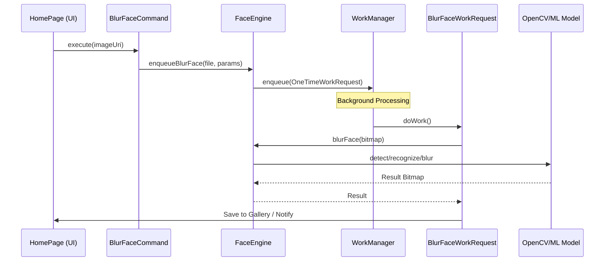

# Jarwis

The power of AI in the palm of my hands!

This is AI utility app for Android device, it basically uses AI model directly on-device to help on performing some tasks.  

## Features
### Face Detection & Recognition
<ul>
    <li>Detect and add blur effect on people face and export the result to gallery</li>
    <li>Detect and select which face to be blurred and export the result to gallery</li>
</ul>

### Neural Style Transfer
<ul>
    <li>Select neural style transfer theme to apply to the image(s) and export the result to gallery.
        (Themes: Mosaic,Candy,Rain Princess,Udnie,Pointilism)
    </li>
</ul>

### On-Demand AI Model Download
<ul>
    <li>AI models are not bundled with the app; when a feature is used for the first time, the
        required models are downloaded once over the internet from their official Hugging Face
        repositories (<code>ModelDownloadDialog</code> enqueues <code>ModelDownloadWorker</code>,
        which runs <code>ModelDownloader</code>)</li>
    <li>Each model is verified against its known sha256 checksum before use, and the download
        progress is streamed live to the UI via <code>ModelChangeNotifier</code> (RxJava)</li>
    <li>An internet connection is only needed for the initial download; afterwards all features
        work fully offline</li>
</ul>

## Architecture

The project follows a modular, layered architecture designed to separate concerns between the UI, business logic, and heavy ML processing.

### Modules

*   **`:app`**: The entry point. Contains the UI, Navigation, and Command implementations. It manages user interaction and delegates tasks.
*   **`:ml-engine`**: The core intelligence. Encapsulates the logic engines (`FaceEngine`, `STEngine`), the AI model catalog with on-demand model download from Hugging Face, and background workers (`WorkManager`).
*   **`:base`**: Shared infrastructure. Contains DI setup (`a-provider` modules), utilities (`FileHelper`, `MediaHelper`), and common UI components.

### Key Libraries

*   **a-navigator**: Handles navigation between pages/activities.
*   **a-provider**: A lightweight Dependency Injection (DI) framework.
*   **StatefulView**: A framework for building state-aware UI components.
*   **RxAndroid (RxJava 3)**: Manages asynchronous events and threading in the UI layer.
*   **WorkManager**: Handles deferrable, guaranteed background work (ML processing).
*   **OpenCV**: Powers the face detection and recognition capabilities.

## Logic Flow & Patterns

The application heavily utilizes the **Command Pattern** to decouple the UI from the execution logic.

### High-Level Workflow

1.  **User Interaction**: The user triggers an action (e.g., "Auto Blur Face") in the UI (`HomePage`).
2.  **Command Execution**: The UI invokes a specific **Command** (e.g., `BlurFaceCommand`).
3.  **Engine Delegation**: The Command prepares the data and delegates the task to a specific **Engine** (e.g., `FaceEngine`).
4.  **Background Work**: The Engine serializes the request and enqueues it to the **WorkManager**.
5.  **Processing**: The background **Worker** (`BlurFaceWorkRequest`) wakes up, deserializes the data, and runs the heavy ML algorithms.
6.  **Result**: The processed image is saved to the gallery, and the user is notified.

### Diagram

### Deep Dive: Face Detection Flow

1.  **HomePage**: Calls `mBlurFaceCommand.execute(uri)`.
2.  **BlurFaceCommand**: Copies the image to a temp file and calls `mFaceEngine.enqueueBlurFace(...)`.
3.  **FaceEngine**:
    *   Creates a `BlurFaceSerialFile` object containing file paths and configuration.
    *   Serializes this object to disk.
    *   Creates a `OneTimeWorkRequest` pointing to `BlurFaceWorkRequest`, passing the serialized file path as input data.
    *   Enqueues the request to `WorkManager`.
4.  **BlurFaceWorkRequest** (Background):
    *   Reads the serialized file.
    *   Loads the image bitmaps.
    *   Calls `faceEngine.blurFace()`.
    *   `FaceEngine` uses `OpenCV`'s `FaceDetectorYN` to find faces and `FaceRecognizerSF` to match identities (if excluding faces).
    *   Applies a blur effect to the detected regions.
    *   Saves the final image using `MediaHelper`.

### Deep Dive: Neural Style Transfer (NST) Flow

1.  **HomePage**: Collects image and theme selection, then calls `mSTApplyCommand.execute(uri, themes)`.
2.  **STApplyCommand**: Delegated to `STEngine.enqueueST(...)`.
3.  **STEngine**: Serializes the request and enqueues a `STApplyWorkRequest`.
4.  **STApplyWorkRequest** (Background):
    *   Deserializes data.
    *   Iterates through selected themes (Mosaic, Candy, etc.).
    *   Calls `STEngine.apply()`, which delegates to specific model processors (e.g., `NSTMosaic`).
    *   Saves each stylized image to the gallery.

## Screenshots

## Support this project
Consider donation to support this project
<table>
  <tr>
    <td><a href="https://teer.id/rh-id">https://teer.id/rh-id</a></td>
  </tr>
</table>
